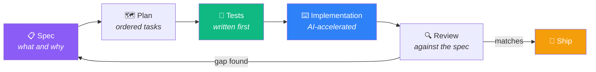

  

  

  
  
  

---

## Two things I am serious about

<table>
<tr>
<td width="50%" valign="top">

### 🤖 Building with AI

I develop **with** AI, not around it. My workflow is spec first: I write the design document, then the implementation plan, then the tests, and only then does code get written. The AI accelerates the typing. It does not make the architectural calls.

You can check that claim. Every product repo here carries the real specs and plans I worked from, in `docs/design/`, dated before the commits that implemented them.

That discipline is why three production-grade products exist with **636 automated tests** behind them.

</td>
<td width="50%" valign="top">

### 📊 Engineering with data

Before the products, data was the job. **ETL and ELT pipelines in Python**, integrity and validation checks, MongoDB and SQL sources reconciled against each other, and datasets loaded and analysed in **BigQuery** and **Cloud Storage**.

The part I actually love is the modelling: choosing the representation that makes a hard question cheap to answer. A street network becomes a graph and an NP-hard route collapses into something solvable. A noisy sales series becomes a question about whether the extra model earns its keep, which sometimes it does not.

</td>
</tr>
</table>

**Both, together, are the point.** AI makes me fast. Data engineering makes me right. Neither is worth much on its own.

---

## 📐 How the AI workflow actually looks

The specs are committed, so this is auditable rather than a claim: [RestoPos](https://github.com/raulben6/restopos/tree/main/docs/design) · [Growly](https://github.com/raulben6/growly/tree/main/docs/design) · [Smart Trader](https://github.com/raulben6/smart-money-app/tree/main/docs/design)

---

## 🧮 Data and algorithms

### 📉 [wings-forecast](https://github.com/raulben6/wings-forecast)

**Forecasting daily sales for a restaurant, from 227 days of its real operating data.**

Three findings, and two of them are negative. **A day-of-week average beat both the Ridge and the gradient boosting model**, and all three sit inside the same bootstrap interval, so they are statistically tied. Then I added El Salvador's holiday calendar and daily weather history, and **both made the models worse**.

The third finding is the one worth acting on. Rain barely moves total sales, but it **doubles the delivery share of revenue**, from 12% to 25% (p = 0.001). Rain does not remove demand, it relocates it, which is exactly why weather cannot forecast the total: the channels compensate. And because the delivery marketplace takes an effective 27% cut, a rainy day converts the same revenue into **3.25 points less margin** (p = 0.0009).

Weather is split into an **operational** mode (yesterday's observed weather, what production could actually use) and an **explanatory** one, because tomorrow's weather is a forecast, not a fact. Validation is walk-forward, never a random split, and nine of the twenty-five tests exist purely to prove no feature can see its own future.

The repo also carries a **read-only exporter for product-level demand**, validated against a live production Postgres: one `SELECT`, aggregated in the database, no access to personal data, amounts indexed before they are written. It reports descriptives at any volume but **refuses to emit forecast metrics below a data threshold**, because the POS has no sales history yet and a model fitted on a handful of rows per product is not a result.

 

### 🗺️ [ruta-cartero](https://github.com/raulben6/ruta-cartero)

**The Rural Postman Problem, solved on a real city street network.**

Every house on 15 streets has to be visited, and the route must start and end at fixed points. That path exists only if the graph is Eulerian, and real street networks never are. So: download the genuine OpenStreetMap cycling graph, pair the odd-degree vertices at **minimum matching cost**, duplicate the connecting paths, then add a **virtual start-to-end edge** so an Eulerian circuit can be built and reopened into the path you actually need.

Cost is measured in minutes rather than metres, because a courtyard or a portal with thirteen mailboxes is expensive in ways distance cannot see. The output is an interactive map you follow on a phone.

> The dataset shipped here is synthetic and reproducible. The original described how to reach specific private homes, so it stays private.

---

## 🚀 Products that shipped

### 🍽️ [RestoPos](https://github.com/raulben6/restopos)

A real-time POS **deployed at a working restaurant**. Orders appear on the kitchen screen instantly, tickets print over raw TCP to a thermal printer, and order history is immutable by design, so editing tomorrow's menu never rewrites yesterday's receipts.

### 📈 [Smart Trader Performance System](https://github.com/raulben6/smart-money-app)

A trading journal with a mentor on the other side. **Every metric is derived from the trades, never stored**, so a cached total cannot drift from reality. Authorization is enforced twice, and proven by a matrix of tests running against a real Postgres embedded in the test process.

### 💰 [Growly](https://github.com/raulben6/growly)

Personal finance built as a real product. Money is stored in **integer cents, never floats**, and recurring transactions are made **idempotent by a database constraint** rather than by trusting a job to run exactly once.

🔒 <b>Also: an automated trading bot</b> (private, collaborative)

 

Node.js bot for Interactive Brokers with a generic host and swappable strategies: bracket order lifecycle, percentage-of-equity sizing, safe end-of-day close, crash recovery, Telegram alerts and a backtesting UI. Dockerized, around 480 commits and 97 test files. The repository stays private because the copyright belongs to its original author.

---

## 🧰 Stack

  

**🤖 AI & Automation**

**📊 Data & Analytics**

**⚙️ Backend & Data Layer**

**🎨 Frontend**

**🧪 Testing**

**🚀 Cloud & Ship**

---

## 📊 By the numbers

<table>
<tr>
<td align="center" width="25%"><h2>5</h2><b>public projects</b></td>
<td align="center" width="25%"><h2>661</h2><b>automated tests</b></td>
<td align="center" width="25%"><h2>295</h2><b>commits</b></td>
<td align="center" width="25%"><h2>38k</h2><b>lines shipped</b></td>
</tr>
</table>

Counted from the repositories on this profile. Not estimated.

---

## 📫 Let's talk

  
  

  <b>Open to roles in AI-assisted development, data engineering, and full stack. Remote or based in El Salvador.</b>

  

